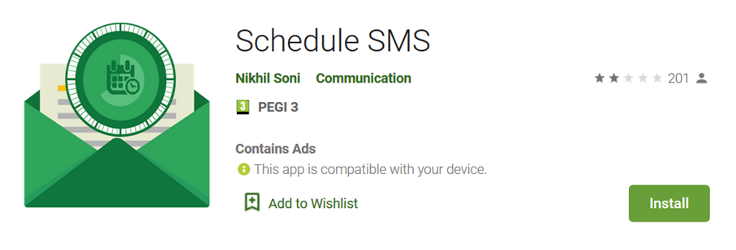
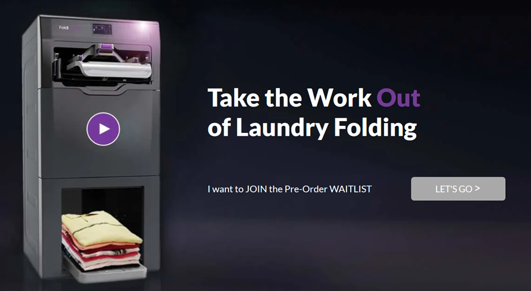

# Automation (Automatisering)
Automation is simpel weg gezegd het vervangen van menselijke arbeid door machines, computers en computerprogramma’s. Hierin zijn veel verschillende onderverdelingen: kantoorautomatisering waarbij werkzaamheden geautomatiseerd worden, industriële automatisering waarbij processen in fabrieken geautomatiseerd worden, grafische automatisering waarbij workflow, ontwerp, print enz geautomatiseerd worden en huis automatisering waarbij huishoudelijk/elektrische apparaten geautomatiseerd worden.

Natuurlijk zijn er ook taken bij die beter door de mens worden uitgevoerd zoals een auto besturen maar toch willen ze dit ook automatisch krijgen. Hierbij is een grote moeilijkheid aangezien je als bestuurder soms situaties moet inschatten en als auto wordt dit moeilijker.
Automatisering is bij sommige dingen totaal niet mogelijk, bijvoorbeeld bij psychologie.

## Kantoorautomatisering
Vroeger werkten ze op kantoren met handmatige administratie, alles werd met pen en papier gedaan. Daarna kwam de mechanische administratie met de schrijf- en de rekenmachine. Door de komst van de computer kwam de elektronische administratie. Kantoorautomatisering gebeurt allemaal via de computer aan de hand van kantoorsoftwarepakketen.

## Industriële automatisering
Alles wat in het productieproces normaal door een persoon gedaan wordt, wordt overgenomen door machines en slimme software. Het is een manier om de processen te versnellen, efficiënter te werken, de kwaliteit van de producten te verbeteren of om de productiecapaciteit te verhogen.
Een belangrijk onderdeel is het aansturen, controleren en beheren van processen en machines. Industriële automatisering richt zich op het optimaliseren van processen en daarmee de productie. Industriële automatisering is eigenlijk de hersenen van je installaties.
Industriële automatisering kom je tegen bij installaties, technische IT-bedrijven en ingenieursbureaus. 

## Grafische automatisering
Een volledig grafisch ontwerp kan niet geautomatiseerd worden, er is nog steeds een creatieve geest nodig. Ze kunnen wel bepaalde handelingen laten automatiseren waardoor ze tijd besparen. Zo kunnen ze meer tijd spenderen in het ontwerpen.

## Huisautomatisering
In het dagelijkse leven wordt de laatste jaren veel meer automatisering gebruikt, denk maar aan de robotstofzuiger of de robotgrasmaaier. Een automatisering die waarschijnlijk iedereen in huis heeft is een thermostaat, die geeft aan wanneer de boiler moet aangaan.
Voorbeelden van automatisering die iedereen gebruikt zonder erbij na te denken is online bankieren, verkeerslichten, verlichting en verwarming via domotica.

Domotica werd als eerst gebruikt in de geautomatiseerde industrie of kantooromgeving, en ook in woningen voor mensen met een functiebeperking. Daarna begon het in de bouw en architectuur op te komen.
Als je nadenkt over automatisering ontdek je hoeveel toepassingen automatisering eigenlijk heeft. Denk maar aan verwarming, verlichting maar ook het voorprogrammeren van uw oven. Een inbraakalarm dat verbonden is met je gsm of met de politie. Een kraan die opengaat wanneer je je handen onder de kraan houdt. Een toilet dat automatisch doorspoelt en er zijn nog zoveel meer toepassingen.

## Voordelen
Er zijn heel veel voordelen aan domotica of automatisering. Het is duurzaam en kostenbesparend, door automatisering wordt je energie beter verbruikt zodat er nooit te veel energie gebruikt wordt. Domotica kan ook bepaalde apparaten uitschakelen naargelang uw verbruik.
Domotica brengt veel comfort, je kan uw hele woning besturen met één klik en vanuit je zetel.
Nog een belangrijkrijk voordeel is de veiligheid, met domotica heb je veel meer mogelijkheden voor veiligheid.

## Wat kan je doen met automatisering?
Je kan super veel dingen doen met automatisering. Niet iedereen gebruikt al veel automatisering maar eigenlijk kunnen veel dagdagelijkse dingen geautomatiseerd worden. Er bestaat bijvoorbeeld een app waarbij je sms'jes kan plannen, je schrijft je sms'je, geeft in wanneer deze precies verzend moet worden. Wanneer het sms'je verzonden is krijg je een melding.

Net zoals een sms'je inplannen kan je ook mails inplannen, dit verloopt op exact dezelfde manier als de smsjes. Het inplannen bestaat zelfs al voor tweets op twitter.

Je kan een app downloaden waar je jouw wekelijkse boodschappen in zet en deze worden wekelijkse automatisch geleverd zodat je voor die boodschappen niet meer naar de winkel moet. Dit is handig aangezien je deze boodschappen toch elke week koopt.

Nog een automatisering van boodschappen is bijvoorbeeld Hello Fresh. Je moet het eten nog steeds zelf klaarmaken maar het proces van beslissen wat je gaat koken, welke ingrediënten die je nodig hebt en naar de supermarkt te gaan valt weg. Dit is ook heel handig voor mensen die niet weten wat ze moeten koken maar ook voor mensen die niet graag naar de supermarkt gaan.

De huis automatisering is denk ik een van de bekendste voorbeelden. Iedereen kent de robotstofzuiger, robotgrasmaaier, google home, alexa enzovoort. Momenteel zijn er zelfs machines in de maak die uw was automatisch opvouwen.

Een heel bekend voorbeeld waarbij mensen niet altijd aan automatisering denken is een domiciliëring. Heel veel mensen gebruiken dit en beseffen waarschijnlijk niet dat dit ook automatisering is aangezien er bij automatisering altijd aan technische snufjes wordt gedacht. Het is gewoon een geautomatiseerd manier om maandelijkse betalingen te doen.

Er zijn veel dingen die behoren tot automatisering maar we vergeten dit vaak omdat we deze dingen vaak gebruiken.

## Wat ga ik met automatisering doen?

Ik ben vooral geïnteresseerd in alles wat met de huis automatisering te maken heeft. Er zijn heel veel verschillende dingen da je daarrond kan doen.
Ik wil graag iets rond voice control/voice assistant, daarbij ga ik gebruik maken van de Google Nest Mini. Wat ik er precies rond ga doen weet ik nog niet. Hiervoor ga ik eerst goed onderzoeken voor wat je de Google Nest Mini kan gebruiken