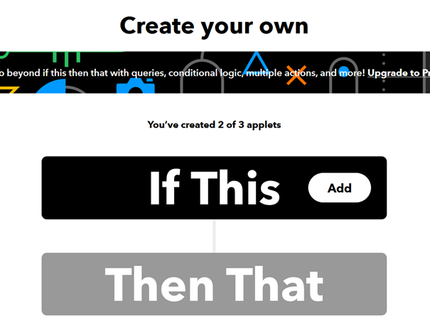
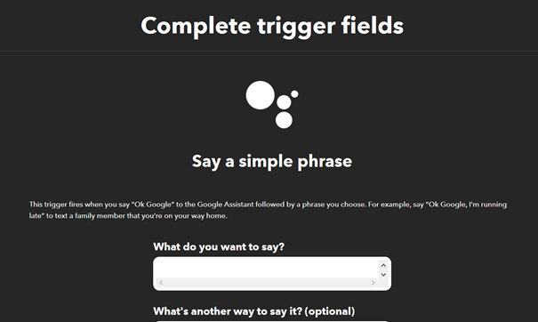
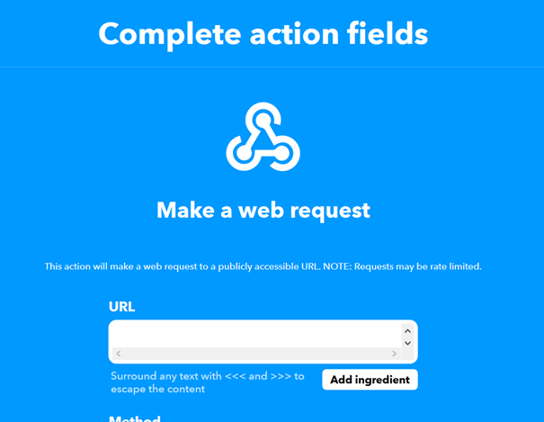
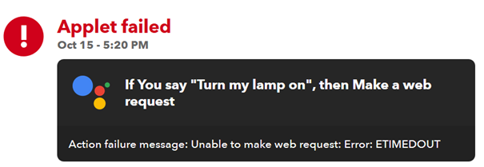
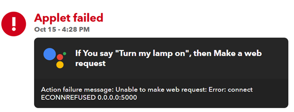

# Project

Tutorial:

Voor mijn project heb ik gekozen om de Google Nest Mini aan te sluiten op de Raspberry Pi om een home automation te simuleren. Ikzelf heb thuis geen home automation producten, daarom ga ik mijn Sense HAT gebruiken als lamp. Door het commando "Hey Google, Turn my lamp on" te zeggen zou de Sense HAT moeten oplichten.

## Benodigdheden

- Google Nest Mini (of andere Google Assistant)
- Raspberry Pi
- Sense HAT
- Voedingskabel
- HDMI-kabel
- SD-kaart met Raspbian
- Toetsenbord
- Muis
- Google account
- IFTTT account

## Stappenplan

Voordat je begint met de Raspberry Pi moet je ervoor zorgen dat de Google Assistant in het stopcontact zit en helemaal in orde staat om hem te gebruiken. Er zit een instructieboekje bij de Google Assistant waar je al die informatie kan vinden. Wanneer de Google Assistant volledig gebruiksklaar is gaan we naar de website van [IFTTT](https://ifttt.com). Op deze website vind je verschillende toepassingen waarbij je de Google Assistant kan gebruiken. IFTTT staat voor If This Then That. Wij gaan zelf een IFTTT aanmaken, hiervoor moet je eerst een account aanmaken en ervoor zorgen dat je Google Account gekoppeld is aan je IFTTT account. Als dit allemaal in orde is kunnen we zelf de IFTTT gaan aanmaken, dit kan je doen via de create knop in het menu.

Als je op de create knop geklikt hebt kom je op het scherm om zelf de If This Then That aan te maken. We gaan eerst de If This en dan pas de Then That aanmaken.

Voor de If This kiezen we als service de Google Assistant. Je hebt enkele opties wat je kiest als trigger, je kan kiezen voor een simpele zin maar het kan ook een zin met een nummer in zijn, hierbij kies je volledig zelf. Ik kies voor de simpele zin aangezien ik voor het trigger "Hey Google, turn my lamp on" kies.

Je kiest welk zinnetje je gaat gebruiken als trigger (in mijn geval "Turn my lamp on"). Je kan er nog een verkorte versie bijzetten (bijvoorbeeld "Lamp on") maar dit is optioneel dus is niet verplicht. Als je drie verschillende opties wilt kan je er nog een derde trigger bijzetten. Daarna kies je of de Google Assistant iets terug zegt, dit is handig aangezien je dan zeker weet of ze het verstaan heeft. Hierbij heb ik gekozen voor "Turning lamp on", simpel maar hierbij ben je zeker dat ze het verstaan heeft. Op het laatste kan je nog een taal kiezen aangezien er geen Nederlands bij zit kies is voor Engels. Als alles ingevuld is kan je het trigger aanmaken en kom je terug op het IFTTT aanmaken scherm. Je kan dit zien aan het balkje want het trigger is daar in toegevoegd (Zie voorbeeld hieronder).

Na de If This is het tijd om de Then That aan te maken. Voor de Then That hebben we de Raspberry Pi nodig, je zorgt ervoor dat alles werkt en dat je hem kan gebruiken. We gaan een klein Python script schrijven om de Sense HAT te laten op lichten.

		from flask import Flask
		from sense_hat import SenseHat

		app = Flask(__name__)
			
		@app.route('/', methods=['GET', 'POST'])
		def index():
			sense = SenseHat()
			sense.show_message('Lamp on')
			return "Lamp on"
			
		@app.route('/off', methods=['GET', 'POST'])
		def off():
			sense = SenseHat()
			sense.clear()
			return "Lamp off"

		if __name__ == "__main__":
			app.run(host='IP address', port=5000, debug=True)

Bij de app.run moet je enkel bij host nog uw IP address invullen. Door de flask hier bij te voegen kunnen we via het IP address het script aanspreken. We gaan eerst terug naar de [IFTTT](https://ifttt.com) website en gaan daar de Then That verder aanvullen. Je zoekt de service Webhooks, je hebt enkel de optie om een Web Request te kiezen dus doen we dit ook.

Bij de URL vullen we het IP address in die we in de script hebben geschreven. Je kiest de methode, ik kies hierbij voor de post methode. Als content type kiezen we voor text/plain en in de body laten we het leeg. Je maakt de actie aan en zo kom je terug terecht op het IFTTT aanmaken scherm. Je hebt beide ingevuld dus zou het nu moeten werken.

Als je nu tegen je Google Assistant "Hey Google, turn my lamp on" zegt dan zegt zij "Turning lamp on" terug en zou de Sense HAT moeten oplichten.

## Problemen

In mijn geval was dit niet zo. Ik ben op een paar problemen gestoten.

Eerst had ik een probleem met de Web Request, ik dacht dat ik met een Github Page ook een Web Request kon doen. Ik had dus van mijn script een Github Page gemaakt, achter wat zoekwerk vond ik dat dit dus niet lukte. Hierdoor ben ik flask en het IP address beginnen gebruiken.

Bij mijn eerste poging heb ik gebruik gemaakt van mijn local IP address van mijn Raspberry Pi. Wanneer ik het trigger zei tegen de Google Assistant zei ze het antwoord terug maar de Sense HAT ging niet oplichten. Bij de IFTTT website heb je een activity pagina waarbij je kan zien welke applets gebruikt worden maar ook welke fout lopen. Hier zag ik dus dat ik een error kreeg. (Zie foto hieronder)

Door wat opzoek werk heb ik gevonden dat het local IP address niet aanspreekbaar is vanop de Google Assistant (terwijl ik het wel kon aanspreken op mijn computer en gsm). Op het internet gaven ze de oplossing om mijn external IP address te gebruiken, deze kan je vinden door gewoon in Google "What's my ip" in te geven. Ik heb dus mijn local IP address vervangen door mijn external IP address maar hierbij gaf mijn script een fout.

		OSError: [Errno 99] Cannot assign requested address

Door deze error ben ik weer op het internet beginnen zoeken wat het precies betekende en hoe ik het kon oplossen. Iemand gaf de tip om 0.0.0.0 als IP address te gebruiken. Ik heb dit dan ook gedaan en mijn script werkte weer. Toen ik het trigger zei tegen de Google Assistant antwoorde ze maar de Sense HAT licht weer niet op. Ik ben dan weer in de activity pagina gaan kijken en zag deze melding.

Spijtig genoeg heb ik de problemen niet kunnen oplossen en werkt het dus niet. Als ik het local IP address gebruik en het gewoon aanspreek via mijn computer werkt het wel, dus enkel de uitwerking met de Google Assistant werkt niet.